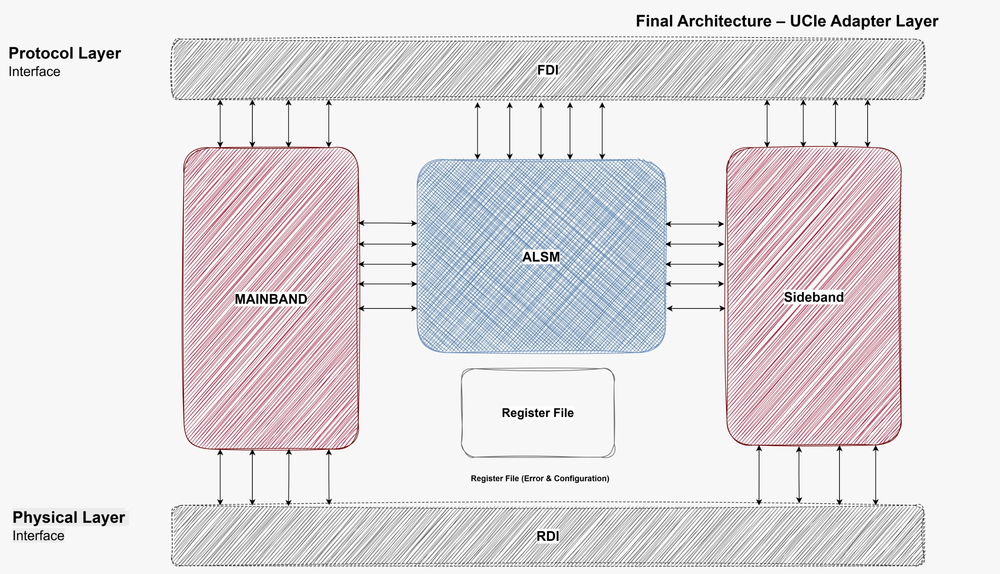
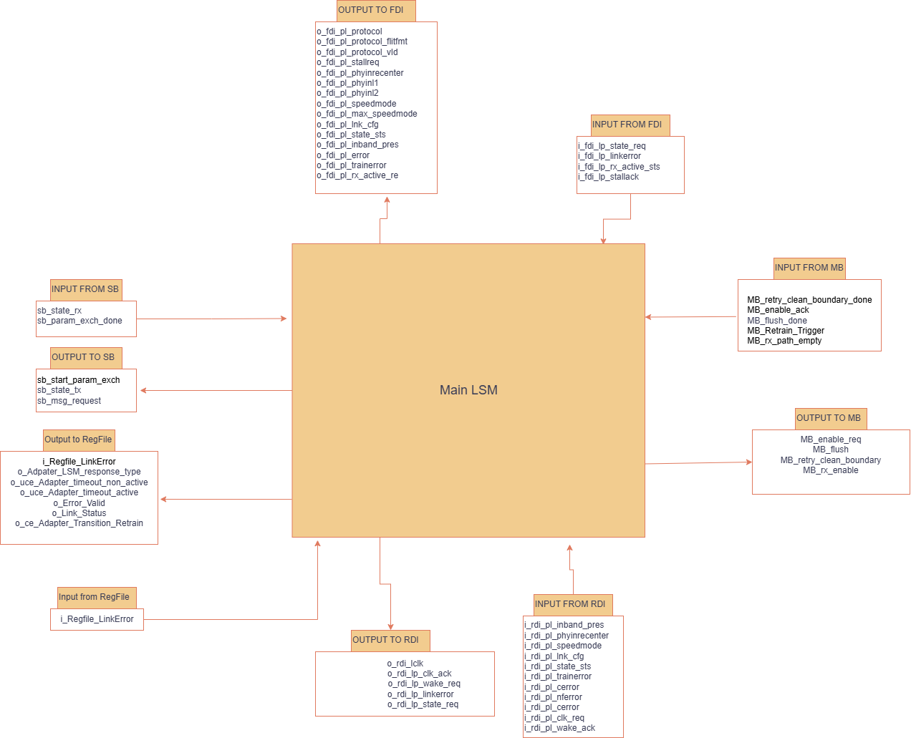

# Graduation-Project---UCIe-Adapter-Layer

This Repo is a UCIe 3.0 D2D adapter layer impelementation.
This sepcific Implementation splits the design into 4 main blocks: Mainband, Sideband, ALSM, and Register File.

## Mainband (Ali Nour and Fatma Fawzy)

## Sideband (Ashraf Sherif and Shahd Mohammad)

## ALSM (Ashraf Sherif and Ali Sakr)

## Register File (Ali Sakr)
